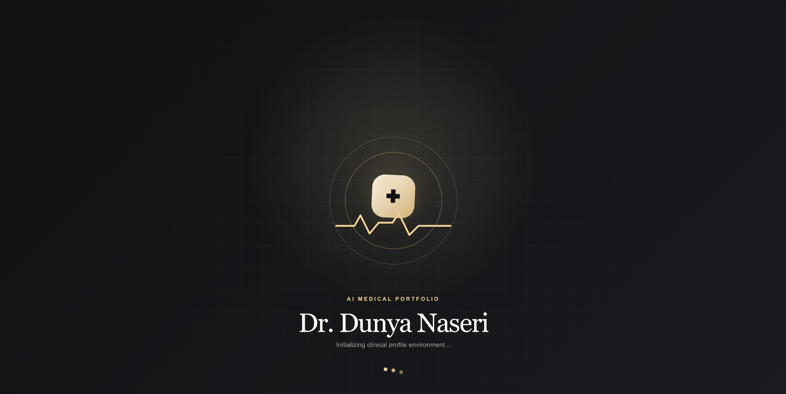
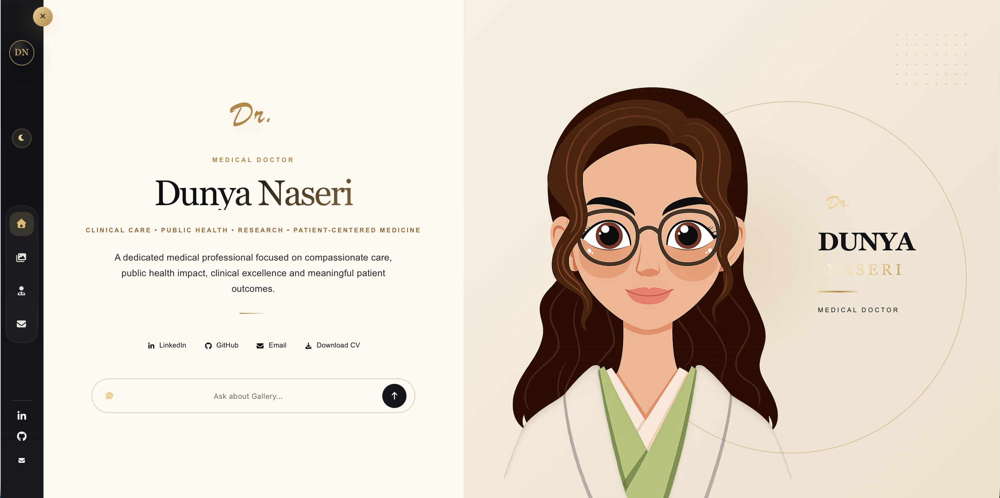
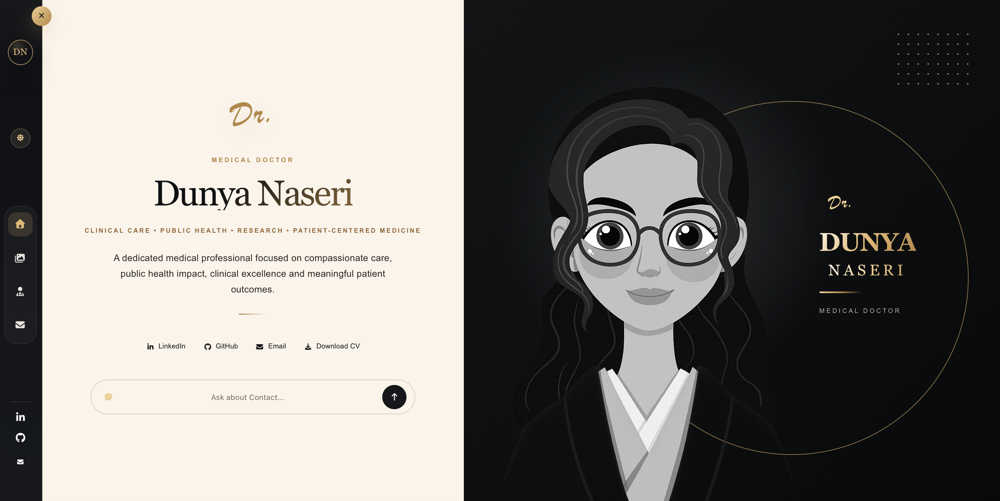
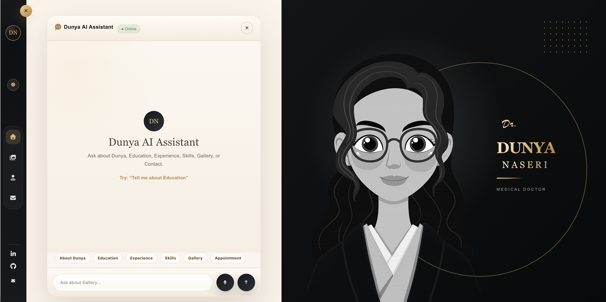
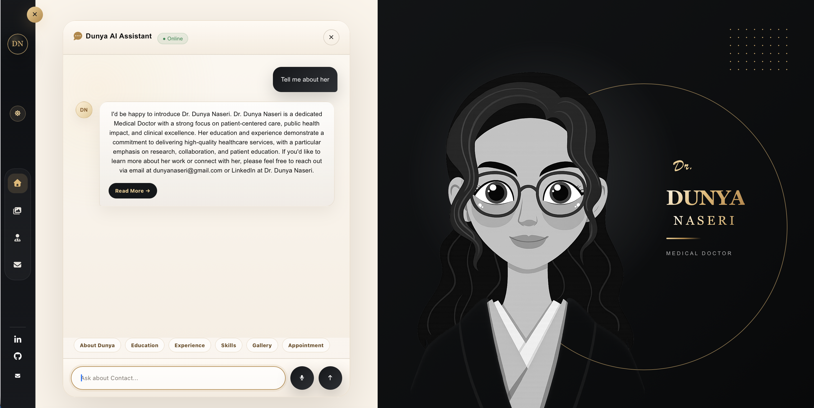
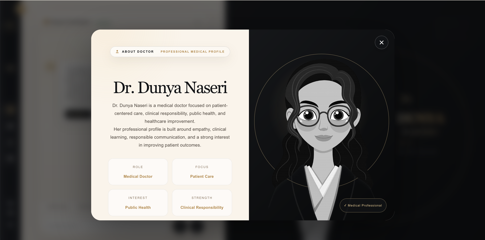
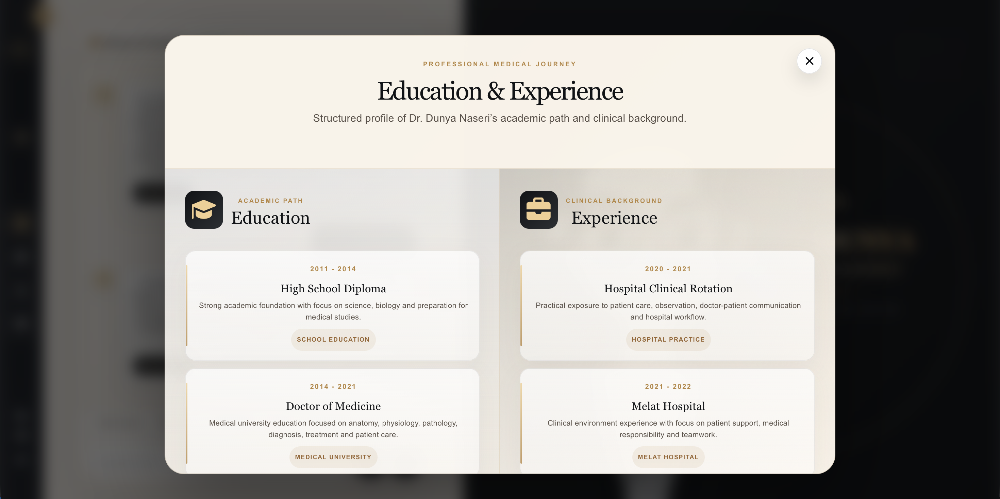
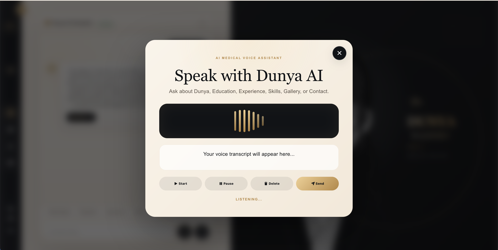
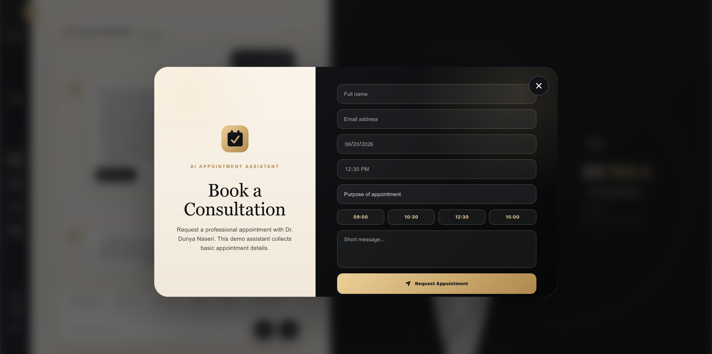
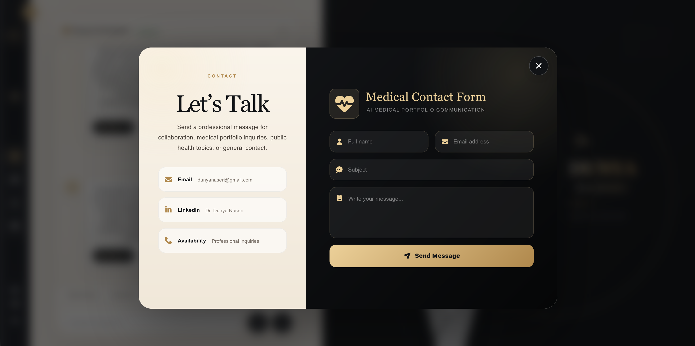

# Dr. Dunya Naseri — AI Medical Portfolio
This project includes a professional doctor profile, AI chatbot, Ollama-powered local AI responses, voice recording assistant, gallery, appointment assistant, contact form and medical-style UI design.

---

## Preview

### Loader 


### Light mode 


### Dark mode 


### AI Chat Interface


### AI Answer Demo


### Doctor Profile


### Education & Experience


### Voice Recording Assistant


### Appointment Assistant


### Contact Form



---

## Features

- Modern medical portfolio UI
- AI chatbot assistant
- Ollama local AI integration
- Llama 3.1 AI model support
- Streaming AI answers
- Voice recording popup
- Doctor profile popup
- Education and experience popup
- Skills section
- Doctor gallery
- Appointment assistant
- Contact form
- Sidebar tooltips
- Theme toggle
- Responsive design
- Black, gold and cream medical style

---

## Tech Stack

- React
- TypeScript
- Vite
- CSS
- FontAwesome
- Node.js
- Express
- Ollama
- Llama 3.1

---

## Project Structure

```text
baseet-ai-portfolio/
├── src/
│   ├── assets/
│   ├── App.tsx
│   └── App.css
│
├── server/
│   ├── index.js
│   └── doctor-data.json
│
├── screenshots/
│   ├── ai-answer.jpg
│   ├── ai-appointment.jpg
│   ├── ai-recording.jpg
│   ├── chat.jpg
│   ├── contact.jpg
│   ├── education.jpg
│   └── profile.jpg
│
├── package.json
├── README.md
└── .gitignore
git add .
git commit -m "Initial release: AI-powered medical portfolio for women in healthcare"


# Author 

Mohammad Baseet Naseri

* Data Scientist
* AI Engineer
* Full-Stack Developer


Portfolio
https://naseriai.com

LinkedIn
https://linkedin.com/in/baseetnaseri6

GitHub
https://github.com/baseetnaseri6

---

# License 

MIT License
